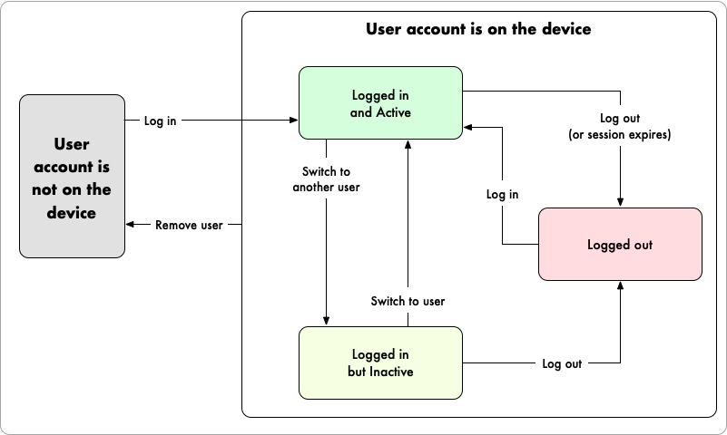

import Tabs from '@theme/Tabs';
import TabItem from '@theme/TabItem';
import CodeBlock from '@theme/CodeBlock';
import AddKotlin from '!!raw-loader!@site/docs/generated/java/sync/MultipleUsersTest.codeblock.add-a-new-user.kt';
import AddJava from '!!raw-loader!@site/docs/generated/java/sync/MultipleUsersTest.codeblock.add-a-new-user.java';
import ListKotlin from '!!raw-loader!@site/docs/generated/java/sync/MultipleUsersTest.codeblock.list-all-on-device-users.kt';
import ListJava from '!!raw-loader!@site/docs/generated/java/sync/MultipleUsersTest.codeblock.list-all-on-device-users.java';
import RemoveKotlin from '!!raw-loader!@site/docs/generated/java/sync/MultipleUsersTest.codeblock.remove-a-user-from-device.kt';
import RemoveJava from '!!raw-loader!@site/docs/generated/java/sync/MultipleUsersTest.codeblock.remove-a-user-from-device.java';
import SwitchKotlin from '!!raw-loader!@site/docs/generated/java/sync/MultipleUsersTest.codeblock.switch-the-active-user.kt';
import SwitchJava from '!!raw-loader!@site/docs/generated/java/sync/MultipleUsersTest.codeblock.switch-the-active-user.java';

The Realm SDK allows multiple users to be logged in to an app
simultaneously on a given device. Client applications run in the context
of a single active user even if multiple users are logged in
simultaneously. You can quickly switch between authenticated users
without requiring them to log in again.

:::important Any logged in user may become the active user without re-authenticating.
Depending on your app, this may be a security vulnerability. For example, a
user on a shared device may switch to a coworker's logged in account without
providing their credentials or requiring their explicit permission. If your
application requires stricter authentication, avoid switching between users
and prefer to explicitly log the active user out before authenticating
another user.
:::

## User Account States

When a user first logs in through a SDK on a given device or
browser, the SDK saves the user's information and keeps track of the user's
state on the device. The user's data remains on the device, even if they log
out, unless you actively remove the user.

The following states describe an on-device user at any given time:

- **Authenticated:** any user that has logged in on the device
  and has not logged out or had its session revoked.
  
  - **Active**: a single authenticated user that is currently using the
    app on a given device. The SDK associates this user with outgoing
    requests and App Services evaluates data access permissions and runs
    functions in this user's context. See active user for
    more information.
   
  - **Inactive**: all authenticated users that are not the current
    active user. You can switch the active user to a
    currently inactive user at any time.

- **Logged Out:** any user that authenticated on the device but
  has since logged out or had its session revoked.

The following diagram shows how users within a client app
transition between states when certain events occur:

## Add a New User to the Device

The SDK automatically adds users to a device when they log in
for the first time on that device. When a user logs in, they immediately become
the application's active user.

<Tabs groupId="java-sdk-languages">
    <TabItem value="kotlin" label="Kotlin">
        <CodeBlock language="kotlin">{AddKotlin}</CodeBlock>
    </TabItem>
    <TabItem value="java" label="Java">
        <CodeBlock language="java">{AddJava}</CodeBlock>
    </TabItem>
</Tabs>

## List All Users on the Device

You can access a list of all user accounts stored on the device. This
list includes all users that have logged in to the client app on a
given device regardless of whether they are currently authenticated.

<Tabs groupId="java-sdk-languages">
    <TabItem value="kotlin" label="Kotlin">
        <CodeBlock language="kotlin">{ListKotlin}</CodeBlock>
    </TabItem>
    <TabItem value="java" label="Java">
        <CodeBlock language="java">{ListJava}</CodeBlock>
    </TabItem>
</Tabs>

## Remove a User from the Device

To remove all information about a user from a device,
use [`user.remove()`](https://docs.mongodb.com/realm-sdks/java/latest/io/realm/mongodb/User.html#remove--)
or [`user.removeAsync()`](https://docs.mongodb.com/realm-sdks/java/latest/io/realm/mongodb/User.html#removeAsync-io.realm.mongodb.App.Callback-):

<Tabs groupId="java-sdk-languages">
    <TabItem value="kotlin" label="Kotlin">
        <CodeBlock language="kotlin">{RemoveKotlin}</CodeBlock>
    </TabItem>
    <TabItem value="java" label="Java">
        <CodeBlock language="java">{RemoveJava}</CodeBlock>
    </TabItem>
</Tabs>

## Change the Active User

You can quickly switch an app's active user to another
logged in user at any time.

<Tabs groupId="java-sdk-languages">
    <TabItem value="kotlin" label="Kotlin">
        <CodeBlock language="kotlin">{SwitchKotlin}</CodeBlock>
    </TabItem>
    <TabItem value="java" label="Java">
        <CodeBlock language="java">{SwitchJava}</CodeBlock>
    </TabItem>
</Tabs>

