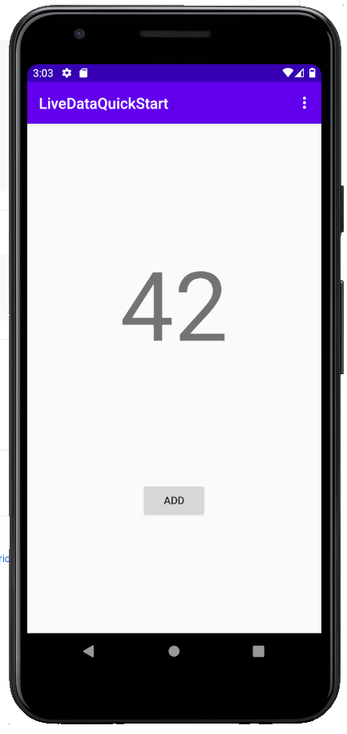

import CodeBlock from "@theme/CodeBlock";
import RealmDependency from "!!raw-loader!@site/docs/generated/java/sync/build.codeblock.realm-dependency.gradle";
import LiveDataDependency from "!!raw-loader!@site/docs/generated/java/sync/build.codeblock.livedata-dependency.gradle";
import SyncEnable from "!!raw-loader!@site/docs/generated/java/sync/build.codeblock.sync-enable.gradle";
import DatabindingEnable from "!!raw-loader!@site/docs/generated/java/sync/build.codeblock.databinding-enable.gradle";
import OnInactive from "!!raw-loader!@site/docs/generated/java/sync/LiveRealmObject.codeblock.oninactive.kt";
import Listener from "!!raw-loader!@site/docs/generated/java/sync/LiveRealmObject.codeblock.listener.kt";
import CounterModelConstructor from "!!raw-loader!@site/docs/generated/java/sync/CounterModel.codeblock.constructor.kt";
import GetCounterModel from "!!raw-loader!@site/docs/generated/java/sync/CounterFragment.codeblock.getcountermodel.kt";
import CounterFragment from "!!raw-loader!@site/docs/generated/java/sync/counter_fragment.xml";
import Binding from "!!raw-loader!@site/docs/generated/java/sync/CounterFragment.codeblock.binding.kt";
import OnActive from "!!raw-loader!@site/docs/generated/java/sync/LiveRealmObject.codeblock.onactive.kt";

This page contains instructions to quickly get Realm Database and Sync
integrated into an example Android application that uses [Android LiveData](https://developer.android.com/reference/androidx/lifecycle/LiveData).
This example application allows a user to increment a counter using a
button.

## Prerequisites

This quick start guide uses Sync to synchronize data
changes between clients. Before you begin, ensure you have:

- [Installed the Java SDK](/sdk/java/install)
- [Created a Realm App](https://www.mongodb.com/docs/realm/manage-apps/create/create-with-realm-ui/#std-label-create-a-realm-app)
- [Enabled anonymous authentication](https://www.mongodb.com/docs/realm/authentication/anonymous/#std-label-anonymous-authentication-configuration)
- [Enabled Sync](https://www.mongodb.com/docs/realm/sync/configure/enable-sync/#std-label-enable-sync)

:::note Follow this Guide Without Sync
To use this quick start without Sync, disable the Sync features
in the SDK. You can do this by removing the following lines from your
app-level `build.gradle` file:

```groovy
realm {
 syncEnabled = true
}
```

After removing the lines, re-synchronize the Gradle configuration to
reload the SDK in an offline-only state. Then, in `CounterModel`:

- Replace `SyncConfiguration` with `RealmConfiguration`
- Remove the lines related to user login, and partition values.

:::

## Clone the LiveData Quick Start Repository

To get started, copy the [example repository](https://github.com/mongodb-university/realm-android-livedata)
into your local environment.

We've already put together an Android application that has
most of the code you'll need. You can clone the client application
repository directly from GitHub:

```sh
git clone https://github.com/mongodb-university/realm-android-livedata.git
```

Then, switch to the `start` branch:

```sh
git checkout start
```

:::important Start and Final Branches
The `realm-android-livedata` repository contains two branches:
`final` and `start`. The `final` branch is a finished version
of the app as it should look _after_ you complete this tutorial.
To walk through this tutorial, please check out the `start`
branch.
:::

## Import Dependencies

Now that you've cloned the repo, you need to add the dependencies you'll
need to run the SDK and Android LiveData. Begin by adding
the SDK dependency to the `buildscript.dependencies`
block of your project level `build.gradle` file:

<CodeBlock language="groovy">{RealmDependency}</CodeBlock>

You'll also have to add the Android LiveData Dependency to the
`dependencies` block of your app level `build.gradle` file:

<CodeBlock language="groovy">{LiveDataDependency}</CodeBlock>

Next, enable Sync in the SDK by creating the
following top-level block in your app level `build.gradle` file:

<CodeBlock language="groovy">{SyncEnable}</CodeBlock>

Then, enable DataBinding by creating the following block in the
`android` block of your app level `build.gradle` file:

<CodeBlock language="groovy">{DatabindingEnable}</CodeBlock>

Finally, select `Build` > `Rebuild Project`
in the application menu to reconfigure your Gradle configuration with
these changes and fetch your dependencies.

## LiveRealmObject

With all of the dependencies in place, it's time to create a
LiveData-compatible interface for our Realm objects. To do so, we'll
have to handle a few events:

- The `onActive()` method enables an observer to subscribe to changes
  to the underlying Realm object by adding a change listener.

  <CodeBlock language="kotlin">{OnActive}</CodeBlock>

- The `onInactive()` method enables an observer to unsubscribe to
  changes to the underlying Realm object by removing the change listener.

  <CodeBlock language="kotlin">{OnInactive}</CodeBlock>

- When a change occurs, the `listener` member uses the `setValue()`
  method of the `LiveData` parent class to pass the Realm object's
  value to the UI unless the object was deleted, in which case the
  change listener passes a value of `null` instead of passing along
  a reference to an invalid, deleted object.

  <CodeBlock language="kotlin">{Listener}</CodeBlock>

:::note Use LiveData with Collections of `RealmResults`
Even though this example project doesn't use LiveData to display
RealmResults, we've also provided an example implementation that follows
these same principles to encapsulate a collection of data contained in a
`RealmResults` object, called [`LiveRealmResults`](https://github.com/mongodb-university/realm-android-livedata/blob/final/app/src/main/java/com/mongodb/realm/livedataquickstart/model/LiveRealmResults.kt).
:::

## Instantiating LiveData in the ViewModel

This application stores all of its logic and core data within a ViewModel
called `CounterModel`. When the application runs, it creates an instance
of `CounterModel` that is used until the application closes. That
instance contains the LiveData that displays on the UI of the application.
To create an instance of LiveData, we need to access a `Counter` object
stored in a realm and pass it to the `LiveRealmObject` constructor.
To accomplish this:

1. Connect to your backend.

2. Authenticate a user.

3. Connect to a specific realm using Sync.

4. Query the realm for a `Counter`, inserting a new `Counter` if
   one hasn't already been created in this realm.

5. Instantiate a `LiveRealmObject` using the `Counter` instance and
   store it in the `counter` member of `CounterModel`.

The following code snippet implements this behavior:

<CodeBlock language="kotlin">{CounterModelConstructor}</CodeBlock>

:::important Fill in Your App ID to connect to your Backend with the Java SDK
To connect to Sync, replace the App ID placeholder with your App ID.
:::

:::note Reads and Writes on the UI Thread
Reads and writes are expensive, frequently involving context switches
and disk I/O operations. As a result, reads and writes are disabled
by default on the UI thread. While you can use the
`allowWritesOnUiThread()` and `allowQueriesOnUiThread()` config
builder methods to enable writes and reads on the UI
thread, you should almost always defer reads and writes to a
background thread using asynchronous patterns.
:::

## Connecting the ViewModel to the UI

To display the data stored in the `CounterModel` on the application UI,
we'll need to access the `CounterModel` singleton using
[`viewModels()`](https://developer.android.com/topic/libraries/architecture/viewmodel#kotlin)
when the application creates `CounterFragment`. Once we've
instantiated the model, we can use the [Android Data Binding](https://developer.android.com/topic/libraries/data-binding)
library to display the model's data in UI elements.

To access the `CounterModel` singleton when the application creates
`CounterFragment`, place the following code in the `onCreateView()`
method of `CounterFragment`:

<CodeBlock language="kotlin">{GetCounterModel}</CodeBlock>

Next, set up the Data Binding hooks in the UI for the counter fragment:

<CodeBlock language="xml">{CounterFragment}</CodeBlock>

Finally, connect the model to the binding so that the UI can display the
counter and iterate the counter on button press with the following code
in the `onCreateView()` method of `CounterFragment`:

<CodeBlock language="kotlin">{Binding}</CodeBlock>

## Running the Application

Now you should be able to run the sample application. You should see an
interface that looks something like this:



Clicking the "ADD" button should add one to the value of your counter.
With Sync, you can view your backend logs to see individual increment
events. Android LiveData is lifecycle-aware, so rotating the screen or
freeing the application's state by clearing your device's RAM should
have no effect on the application state, which should seamlessly resume
and automatically resubscribe to events on resume using the state stored
in the model singleton and the encapsulated LiveData instance.
