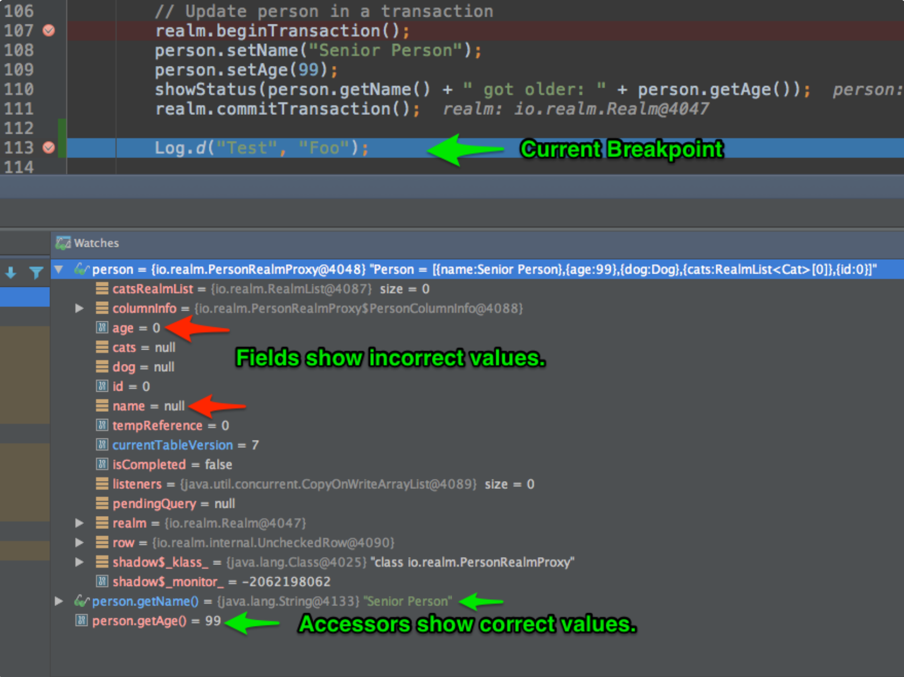

import {variables} from '@site/variables';

This page contains solutions for common errors in the Java SDK.

## Couldn't load `librealm-jni.so`

If your app uses native libraries that don’t ship with support for
64-bit architectures, Android will fail to load Realm’s
`librealm-jni.so` file on ARM64 devices. This happens because Android
cannot load 32-bit and 64-bit native libraries concurrently. Ideally,
all libraries could provide the same set of supported ABIs, but
sometimes that may not be doable when using a 3rd-party library.

To work around this issue, you can exclude Realm’s ARM64 library from
the APK file by adding the following code to the application’s
`build.gradle`. You can refer to Mixing 32- and 64-bit Dependencies in Android for more information.

```groovy

android {
   //...
   packagingOptions {
       exclude "lib/arm64-v8a/librealm-jni.so"
   }
   //...
}
```

:::info See Also

For more information, see [Mixing 32- and 64-bit Dependencies in Android](https://corbt.com/posts/2015/09/18/mixing-32-and-64bit-dependencies-in-android.html).
:::

## Network Calls to Mixpanel

The SDK collects anonymous analytics when you run the
Realm bytecode transformer on your source code. This is
completely anonymous and helps us improve the product by flagging:

- which version of the SDK you use
- which operating system you use
- if your application uses Kotlin
- if your application uses Realm Database or Sync

Analytics do not run when your application runs on user devices - only
when you compile your source code. To opt out of analytics, you can set
the `REALM_DISABLE_ANALYTICS` environment variable to `true`.

## Change Listeners in Android 12 with SDK Versions Below 10.5.1

Due to a change in the Linux kernel,
object, collection, and realm notifications do not work in SDK versions
below 10.5.1 on devices running certain early versions of
Android 12.

This change effects Linux kernel versions beginning with `5.5`.
Linux kernel version `5.14-rc4` fixed the issue. The fix was
also backported to `LTS 5.10.56` and `LTS 5.13.8`. All mainline
and LTS Android 12 branches contain the fix or a backport of it.

If you experience this issue, you can restore notification functionality
with the following fixes:

- upgrade to a version of the SDK later than 10.5.1.
- upgrade to a version of Android 12 that uses a Linux kernel release
  that contains the fix (kernel commit `3a34b13a88caeb2800ab44a4918f230041b37dd9`)
  or the backport of the fix (kernel commit `4b20d2de0b367bca627b49efd8d2e9e01bb66753`).

## Configurations Cannot be Different if Used to Open the Same File

The SDK runs checks whenever you open a realm file to
avoid corruption. In order to avoid accidentally opening a file simultaneously
with incompatible settings, the SDK uses Java's `equals()` method
to compare `RealmConfiguration` objects. This prevents the SDK from
opening a single realm file with different schemas, durability levels,
or writability settings. However, configurations that include lambda
functions, such as those passed to
[`initialData()`](https://www.mongodb.com/docs/realm-sdks/java/latest/io/realm/RealmConfiguration.Builder.html#initialData-io.realm.Realm.Transaction-)
and
[`compactOnLaunch()`](https://www.mongodb.com/docs/realm-sdks/java/latest/io/realm/RealmConfiguration.Builder.html#compactOnLaunch-io.realm.CompactOnLaunchCallback-)
can break this `equals()` comparison, since two different lambdas are
never considered equal using Java's built-in comparison.
To avoid this error when using lambdas, you can either:

1. Store a single configuration statically in your application, so that
   separate realm instances use the exact same
   `RealmConfiguration` object and it passes the check.

1. Override the default equals check of the `RealmConfiguration`:

   ```kotlin

   val config = RealmConfiguration.Builder()
       .initialData(object: Realm.Transaction {
           override fun execute(realm: Realm) {
               TODO("Not yet implemented")
           }

           override fun equals(other: Any?): Boolean {
               return true
           }

           override fun hashCode(): Int {
               return 37
           }
       }).build()
   ```

## Kapt Exceptions During Builds

If you experience an exception in the Kapt library with a description
like the following:

```
A failure occurred while executing org.jetbrains.kotlin.gradle.internal.KaptWithoutKotlincTask$KaptExecutionWorkAction
```

This most likely means there is an issue with one of your model classes.
Possible causes include:

- introducing a field type that is not [supported](/sdk/java/realm-database/schemas/data-types/supported-types) by the SDK
- using a visibility type other than `open` or `public` for a realm object model class
- using a Realm annotation on an incompatible field

If you experience this error, check any recent updates to your schema for
problems.

## Android Studio Debugging

:::warning
The Android Studio debugger can provide misleading values for
Realm object fields. For correct values, you can watch
accessor values instead, or use the Realm object
`toString()` method to see the latest field values.
:::

This section details information you should keep in mind when debugging
Realm applications with Android Studio to avoid incorrect
value reporting. When you watch a Realm object,
you'll see values displayed in the object's fields. These values
are incorrect because the field values themselves are not used. This is
because Realm creates a proxy object behind the scenes, overriding
the getters and setters to access the persisted data in the
realm. To see the correct values, add a watch on the accessors.
See the image below:



In the image above, the debugger has stopped on line `113`. There are
three watch values:

- The `person` variable
- The `person.getName()` accessor
- The `person.getAge()` accessor

The code from lines `107` to `111` alters the `person` instance by
changing the name and age in a write transaction. On line `113`, the
`person` watch instance reports incorrect values for the _field_ watch
values. The watch values that use the _accessors_ report values that are
correct.

## NDK Debugging

The Java SDK library contains native code.
Debugging NDK crashes can be cumbersome, as the default stack trace
provides minimal information.

We recommend you use a crash reporting tool such as
[Crashlytics](http://www.crashlytics.com/). This gives you the
ability to track native errors and gather other valuable information. We
can help with your issues faster if you have this information.

To enable NDK crash reporting in Crashlytics for
your project, add the following to the root of your application
`build.gradle` file:

```groovy
crashlytics {
  enableNdk true
}
```

:::note
The values `androidNdkOut` and `androidNdkLibsOut` are not needed.
:::

## Installation Size

Once your app is built for release and split for distribution, the SDK
should only add about 800KB to your APK in most cases. The releases are
significantly larger because they include support for more architectures,
such as ARM7, ARMv7, ARM64, x86, and MIPS. The APK file contains all
supported architectures, but the Android installer only installs native
code for the device’s architecture. This means that the installed app
is smaller than the size of the APK file.

You can reduce the size of the Android APK itself by splitting the APK
into a version for each architecture. Use the Android Build Tool ABI
Split support by adding the following to your `build.gradle`:

```groovy
android {
    splits {
        abi {
            enable true
            reset()
            include 'armeabi-v7a', 'arm64-v8a', 'x86', 'x86_64'
        }
    }
}
```

Select the architectures that you’d like to include to build a separate
APK for each.

:::note See Also

Check out the [Android Tools documentation on ABI Splits](https://developer.android.com/studio/build/configure-apk-splits.html)
or [our example on GitHub](https://github.com/realm/realm-java/tree/master/examples/gridViewExample)
for more information about releasing multiple APKs.
:::

If you don’t want to handle multiple APKs, you can restrict the number
of architectures supported in a single APK. This is done by adding
`abiFilters` to your `build.gradle`:

```groovy
android {
    defaultConfig {
        ndk {
            abiFilters 'armeabi-v7a', 'arm64-v8a', 'mips', 'x86', 'x86_64'
        }
    }
}
```

:::note See Also
For more details about ABI splits and filters, see
[Controlling APK Size When Using Native Libraries](https://android.jlelse.eu/controlling-apk-size-when-using-native-libraries-45c6c0e5b70a).
:::

## Customize Dependecies Defined by the Realm Gradle Plugin

The SDK uses a Gradle plugin to make it easier to set
up a large number of dependencies. Unfortunately this also makes it a
bit harder to ignore specific transitive dependencies.

If you want to customize the SDK installation beyond what is exposed by the
plugin, you can manually set up all the dependencies and ignore the
Gradle plugin. The following example demonstrates how to set up the SDK
for an Android application using Kotlin manually:

<pre><code parentName="pre" {...{
            "language": "groovy"
          }}>
{`
buildscript {
    ext.kotlin_version = '${variables.kotlin_version}'
    ext.realm_version = '${variables.java_sdk_version}'
    repositories {
        jcenter()
        mavenCentral()
    }
    dependencies {
        classpath "io.realm:realm-transformer:${variables.java_sdk_version}"
        classpath "org.jetbrains.kotlin:kotlin-gradle-plugin:${variables.kotlin_version}"
    }
}

apply plugin: 'com.android.application'
apply plugin: 'kotlin-android'
apply plugin: 'kotlin-kapt'

import io.realm.transformer.RealmTransformer
android.registerTransform(new RealmTransformer(project))

dependencies {
    api "io.realm:realm-annotations:${variables.java_sdk_version}"
    api "io.realm:realm-android-library:${variables.java_sdk_version}"
    api "io.realm:realm-android-kotlin-extensions:${variables.java_sdk_version}"
    kapt "io.realm:realm-annotations-processor:${variables.java_sdk_version}"
}
`}
</code></pre>