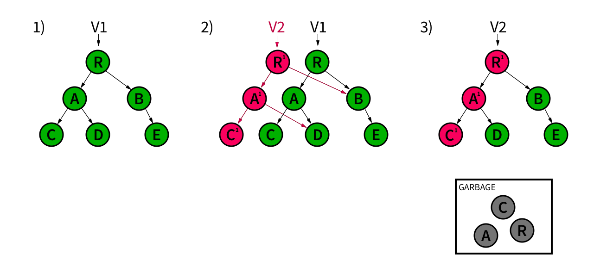

import Tabs from '@theme/Tabs';
import TabItem from '@theme/TabItem';
import CodeBlock from '@theme/CodeBlock';
import RefreshKotlin from '!!raw-loader!@site/docs/generated/java/local/ThreadingTest.codeblock.refresh-realm.kt';
import RefreshJava from '!!raw-loader!@site/docs/generated/java/local/ThreadingTest.codeblock.refresh-realm.java';

To make your Android apps fast and responsive, you must
balance the computing time needed to lay out the visuals and
handle user interactions with the time needed to process
your data and run your business logic. Typically, app
developers spread this work across multiple threads: the
main or UI thread for all of the user interface-related
work, and one or more background threads to compute heavier
workloads before sending it to the UI thread for
presentation. By offloading heavy work to background
threads, the UI thread can remain highly responsive
regardless of the size of the workload.

## Three Rules to Keep in Mind

The SDK enables simple and safe multithreaded code when you
follow these three rules:

Avoid writes on the UI thread if you write on a background thread:
  You can write to a realm from any thread, but there can be only one
  writer at a time. Consequently, write transactions block
  each other. A write on the UI thread may result in your
  app appearing unresponsive while it waits for a write on a
  background thread to complete. If you are using
  Sync, avoid writing on the UI thread as Sync writes on a background
  thread.

Don't pass live objects, collections, or realms to other threads:
  Live objects, collections, and realm instances are
  **thread-confined**: that is, they are only valid on the
  thread on which they were created.
  This means you cannot pass live instances to other
  threads. However, Realm Database offers several mechanisms for
  sharing objects across threads.

Don't lock to read:
  Realm Database's Multiversion Concurrency Control architecture
  eliminates the need to lock for read operations. The
  values you read will never be corrupted or in a
  partially-modified state. You can freely read from realms
  on any thread without the need for locks or mutexes.
  Unnecessarily locking would be a performance bottleneck
  since each thread might need to wait its turn before
  reading.

## Communication Across Threads

Live objects, collections, and realms are **thread-confined**. If
you need to work with the same data across multiple threads, you should
open the same realm on multiple threads as separate realm
instances. The Java SDK consolidates underlying connections across
threads where possible to make this pattern more efficient.

When you need to communicate across threads, you have
several options depending on your use case:

- To modify the data on two threads, query for the object on both
  threads using a primary key.

- To send a fast, read-only view of an object to other threads,
  freeze the object.

- To keep and share many read-only views of the object in your app, copy
  the object from the realm.

- To react to changes made on any thread, use
  notifications.

- To see changes from other threads in the realm on the current
  thread, refresh your realm instance. Looper threads refresh
  automatically.

### Intents

Managed objects are not thread-safe or `Parcelable`, so you cannot pass
them between activities or threads via an `Intent`. Instead, you can
pass an object identifier, such as a primary key,
in the `Intent` extras bundle. Then, you can open a new realm instance
in the separate thread to query for that identifier. Alternatively, you
can freeze objects.

:::tip See Also
You can find working examples in the [Passing Objects](https://github.com/realm/realm-java/blob/master/examples/threadExample/src/main/java/io/realm/examples/threads/PassingObjectsFragment.java)
portion of the [Java SDK Threading Example](https://github.com/realm/realm-java/tree/master/examples/threadExample>).
The example shows you how to pass IDs and retrieve an object
in common Android use cases.
:::

## Refresh Realms

When you open a realm, it reflects the most recent successful write
commit and remains on that version until it is **refreshed**. This means
that the realm does not see changes that happened on another thread
until the next refresh. Realms on any Looper thread 
(including the UI thread) automatically refresh themselves at the
beginning of that thread's loop. However, you must manually refresh
realm instances that are tied to non-looping threads or that have
auto-refresh disabled. To refresh a realm, call
[`Realm.refresh()`](https://docs.mongodb.com/realm-sdks/java/latest/io/realm/Realm.html#refresh--):

<Tabs groupId="java-sdk-languages">
    <TabItem value="kotlin" label="Kotlin">
        <CodeBlock language="kotlin">{RefreshKotlin}</CodeBlock>
    </TabItem>
    <TabItem value="java" label="Java">
        <CodeBlock language="java">{RefreshJava}</CodeBlock>
    </TabItem>
</Tabs>

:::note Refresh on Write
Realms also automatically refresh after completing a write transaction.
:::

## Realm's Threading Model in Depth

Realm Database provides safe, fast, lock-free, and concurrent access
across threads through Multiversion Concurrency Control (MVCC).

### Compared and Contrasted with Git

If you are familiar with a distributed version control
system like [Git](https://git-scm.com/), you may already
have an intuitive understanding of MVCC. Two fundamental
elements of Git are:

- Commits, which are atomic writes.
- Branches, which are different versions of the commit history.

Similarly, Realm Database has atomically-committed writes in the form
of transactions. Realm Database also has many different versions of
history at any given time, like branches.

Unlike Git, which actively supports distribution and
divergence through forking, a realm only has one true latest
version at any given time and always writes to the head of
that latest version. Realm Database cannot write to a previous
version. This makes sense: your data should converge on one
latest version of the truth.

### Internal Structure

A realm is implemented using a [B+ tree](https://en.wikipedia.org/wiki/B%2B_tree)
data structure. The top-level node represents a
version of the realm; child nodes are objects in that
version of the realm. The realm has a pointer to its latest
version, much like how Git has a pointer to its HEAD commit.

Realm Database uses a copy-on-write technique to ensure
isolation and durability. When you make changes, the SDK copies the
relevant part of the tree for writing, then commits the changes in two
phases:

- Write changes to disk and verify success.
- Set the latest version pointer to point to the newly-written version.

This two-step commit process guarantees that even if the
write failed partway, the original version is not corrupted
in any way because the changes were made to a copy of the
relevant part of the tree. Likewise, the realm's root
pointer will point to the original version until the new
version is guaranteed to be valid.

#### Commit Process

The following diagram illustrates the commit process:

1. The realm is structured as a tree. The realm has a pointer to its
   latest version, V1.

1. When writing, Realm Database creates a new version V2 based on V1.
   Realm Database makes copies of objects for modification (A1, C1),
   while links to unmodified objects continue to point to the original
   versions (B, D).

1. After validating the commit, Realm Database updates the realm's
   pointer to the new latest version, V2. Realm Database then discards
   old nodes no longer connected to the tree.

### Zero-Copy

Realm Database uses zero-copy techniques like memory mapping to handle
data. When you read a value from the realm, you are virtually looking at
the value on the actual disk, not a copy of it. This is the basis for
live objects. This is also why a realm head pointer can be set to point
to the new version after the write to disk has been validated.
